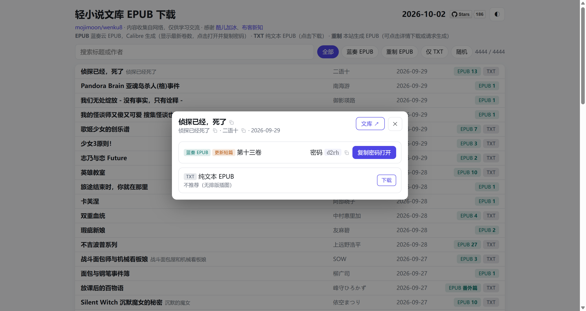

# 轻小说文库 EPUB 下载 - [wenku.mojimoon.top](https://wenku.mojimoon.top)

An automated crawler and static site generator for light novel ebooks from [轻小说文库](https://www.wenku8.net): multiple download sources, daily updates, on-demand EPUB rebuilding with illustrations, and GitHub Actions deployment.

---

[](https://github.com/mojimoon/wenku8/actions/workflows/deploy.yml) [](https://github.com/mojimoon/wenku8/actions/workflows/scrape.yml) [](https://github.com/mojimoon/wenku8/actions/workflows/build_epub.yml)



自动化从 [轻小说文库](https://www.wenku8.net) 获取 EPUB 格式电子书，并将结果整合为单页网页 [wenku.mojimoon.top](https://wenku.mojimoon.top)：

- **蓝奏 EPUB**：Calibre 生成，来自论坛整理（括号/卷名为最新卷）。点击按钮会复制密码并打开蓝奏云
- **TXT 源**：纯文本 EPUB（无样式、无插图），特别感谢 [布客新知](https://github.com/ixinzhi) 整理
- **重制 EPUB**：对没有蓝奏 EPUB 的小说，由 GitHub Actions 从源站重新抓取生成，含封面、插图、简介和分卷目录，**按卷下载**
    - 日常批量预生成，也可在详情窗口中「请求生成」：选择插图分辨率、是否含插图、指定卷，提交预填好的 Issue 后由 Actions 自动生成并回复下载链接
- 搜索书名/别名/作者或 aid（也可直接粘贴 wenku8 链接），按来源筛选；适配手机与深色模式；书名、作者、密码均可一键复制
- 页面为单个 HTML（数据与样式内联，无外部 CSS/JS），所有 GitHub 文件统一通过 [gh-proxy.org](https://gh-proxy.org/) 下载
- 旧的 `epub.html` 会跳转到 `index.html?f=epub`

## Star History

**如果您觉得这个项目有用，点个 Star 支持一下吧！Thanks! 😊**

[](https://www.star-history.com/?repos=mojimoon/wenku8&type=date&legend=top-left)

## Usage

克隆仓库并安装依赖：

```bash
git clone https://github.com/mojimoon/wenku8
cd wenku8
pip install -r requirements.txt
```

### 爬虫方式

抓取层位于 `utils/fetcher.py`，供所有脚本共用，可通过 `--scraper`（`main.py` 为第一个参数）切换，**失败时按下表顺序自动升级**：

| 方式 | 说明 |
| --- | --- |
| `requests` | 境内/本机 IP 可用（UA 需为简短的 `Mozilla/5.0`，完整浏览器 UA 反而会被 Cloudflare 拦截） |
| `curl_cffi` | 模拟 Chrome 的 TLS 指纹，**GitHub Actions 上实测可通过**，默认方式，速度快 |
| `playwright` | 本地 headless Chromium |
| `steel` | [Steel](https://steel.dev) 云端浏览器，最稳但有额度限制 |

> GitHub Actions 的 IP 会被 Cloudflare 拦截：实测 `curl_cffi`、`patchright`、`camoufox`、Steel、WARP 可通过，普通 `requests` 与有头 Chromium 不行。

如需使用 `playwright` 或 `steel`：

```bash
python -m playwright install
```

`steel` 还需在项目根目录创建 `.env` 文件，填入从 [Steel 控制台](https://app.steel.dev/quickstart) 获取的 API Key：

```
STEEL_API_KEY=...
```

### Cookie

wenku8 需要登录才能访问论坛与部分页面。在浏览器中登录后，将 Cookie 保存为项目根目录的 `COOKIE` 文件（单行），开头如下所示（也可使用环境变量 `WENKU8_COOKIE`）：

```
jieqiUserCharset=utf-8; jieqiVisitId=...; ...
```

GitHub Actions 中通过 Secrets 提供：`WENKU_COOKIES`（Cookie）、`STEEL_API_KEY`（可选）。

## Workflow

### 页面数据（`txt.py` → `main.py`）

运行 `txt.py`：

- `incremental_scrape()` 获取最新的 TXT 源下载列表
    - 输出：`txt/*.csv`
    - 由于 GitHub API 限制最多显示 1,000 条数据，请检查是否有遗漏。如有，可以手动下载后运行 `filelist_to_csv.py` 进行转换。
- `merge_csv()` 合并、去重
    - 输出：`out/txt_list.csv`

运行 `main.py [scraper]`（`none` 表示只重新合并并生成页面，不联网）：

- `scrape()` 获取最新的 EPUB 源下载列表
    - 输出：`out/dl.txt`, `out/post_list.csv`
- 增量刷新 wenku8 全站目录的前 3 页（新书、更新都在这里），见下文
- `merge()`（`merge.py`）把三个来源合并成 `out/merged.csv`，见下文
- `create_html()` 以 `source/template.html` 为模板，嵌入数据生成单页
    - 输出：`docs/index.html`、`docs/epub.html`（跳转页）
    - 数据来源：`out/merged.csv`、`out/epub_index.json`（已生成的重制版）

`scrape.yml` 每天自动运行 `main.py`，将 `out/`、`docs/` 提交到 `main` 并部署到 GitHub Pages；`deploy.yml` 在手动推送到 `main`、或重制版索引更新后（由 `build_epub.yml` / `build_request.yml` 触发）用现有 `out/` 数据重新生成页面并部署，不运行爬虫。

### 条目合并（`merge.py`、`utils/names.py`、`utils/catalog.py`）

论坛帖（EPUB）、TXT 源、蓝奏列表对同一本书的写法常常不同（简称/别名/译名、年份不同的多个 TXT 版本……），所以**以 wenku8 的 aid 为唯一标识**来合并，保证每本书只有一条：

1. `out/wenku_catalog.json`：wenku8 全站目录（书名、作者 → aid，约 4300 本），是权威来源。`python -m utils.catalog` 补全抓取（可断点继续），`--refresh 3` 增量刷新；`main.py` 每天自动增量刷新。
2. 论坛帖的 `novel_link` 本身带 aid；若帖子书名与该 aid 在目录中的书名几乎无关（链接填错），按书名在目录中重新对应。
3. `dl.txt` 的名称 → 帖子 → aid（名称被截断时按前缀对应，多个候选时取最新帖子）。
4. TXT 源（只有书名、作者）→ aid，分层匹配（`utils/names.py`）：人工别名表 → 书名精确（完整名 > 主书名 > 括号内别名，多个候选用作者裁决）→ 同作者模糊 → 全局模糊。书名中的数字必须一致；带“外传/官方/短篇”等标记的衍生作品不会被当成正传。
5. 同一个 aid 只保留**最新**的 TXT 版本；书名、作者统一取目录里的写法；对应不上 aid 的 TXT 条目单独保留（`out/txt_unmatched.csv`，按书名+作者去重）。

自动匹配不了的少数条目写在 `out/txt_alias.csv`（列 `title,aid`）。

### 重制 EPUB（`gen_epub.py`、`build_batch.py`、`build_request.py`）

TXT 源的 EPUB 只有纯文本，所以对这些小说（`merged.csv` 中有 aid、有 TXT 源、没有蓝奏源的条目）从 wenku8 重新抓取目录、正文与插图，生成带封面、简介、分卷目录的 EPUB3（`epub_maker.py` 直接用 `zipfile` 写入，生成结果可通过 epubcheck）。插图默认长边压缩到 1000px（JPEG），体积约为原图的 1/5。

```bash
python gen_epub.py --aid 129                       # 整本
python gen_epub.py --aid 129 --split               # 按卷：out/epub/129/v01.epub ...
python gen_epub.py --aid 129 --split --max-side 800 --no-images --volumes 1,3
```

- **批量预生成** `.github/workflows/build_epub.yml`（每日定时 / 手动触发）：`build_batch.py` 为尚未生成、或 TXT 源已更新的小说按卷生成并上传到 Release（`epub-NN`，每个 Release 容纳 200 个 aid），状态记录在 `out/epub_index.json`（每个 aid 一行）。Release 附件带有「书名 卷名 (aid)」显示名，Release 说明列出其中每本小说的 aid、书名、作者、卷数。wenku8 因版权下架的小说（正文只剩下架公告）会被识别并标记为 `blocked`，页面不再提供请求生成；`python build_batch.py --check-blocked` 可只扫描详情页预先标记。每本生成后立即上传并保存，中断后重跑即可继续；章节有 429 限流时自动退避。
- **按需生成** `.github/workflows/build_request.yml`：网页「请求生成」会预填一个标题以 `[build]` 开头的 Issue（模板 `.github/ISSUE_TEMPLATE/build-request.md`），`build_request.py` 解析后生成并在 Issue 回复下载链接。Issue 带 `build-request` 标签。含插图且分辨率 ≥ 1000（含原图）的结果按卷缓存：1000px 即页面上的默认版本（`epub-NN`），1400/1600/原图在 `epub-var-NN`，再次请求相同版本时直接回复；600/800/无图为临时版本，上传到 `epub-custom`。
    - Issue 内容视为不可信输入，仅通过环境变量传入并严格校验（aid 必须在仅 TXT 源列表中，分辨率限定枚举）
    - `issues` 事件只会运行默认分支（`main`）上的工作流
- 其他 Issue 模板：`.github/ISSUE_TEMPLATE/feedback.yml`（意见、建议与数据错误反馈）

## Remarks

- 页面不再使用 CDN：HTML 内联 CSS/JS 与数据（约 0.9 MB，gzip 后更小），列表按需分批渲染，首屏很快。
- 模板源码在 `source/template.html`，修改后运行 `python -c "import main; main.create_html()"` 即可重新生成 `docs/index.html`。

> 加快 GitHub Pages 国内访问速度可参考本人博客中的 [这篇文章](https://mojimoon.github.io/blog/2025/speedup-github-page/)。

## License

[MIT License](LICENSE)
